# jscad-mcp examples — walkthroughs

Each section covers one demo: what it is, why visual feedback matters for it,
screenshots from the iteration loop, and how to try it locally or in your browser.

## Contents

1. [Cycloidal drive reducer](#cycloidal-drive-reducer) — named parts + highlight
2. [Cutaway 4-stroke engine](#cutaway-4-stroke-engine) — slice (cross-section)
3. [Gyroid lattice cube](#gyroid-lattice-cube) — slice (TPMS section)
4. [Lofted vase](#lofted-vase) — extrudeFromSlices morphing cross-section
5. [Voronoi-pattern panel](#voronoi-pattern-panel) — 2D pattern → extrude
6. [Threaded bolt + nut](#threaded-bolt--nut) — helical sweep + slice engagement
7. [Spur gear pair](#spur-gear-pair) — meshing cosine-tooth gears
8. [Snap-fit parametric box](#snap-fit-parametric-box) — tolerance-driven plastic-part design
9. [Sliding caliper jaws](#sliding-caliper-jaws) — animated mechanism via parameter sweep
10. [Heatsink fin array](#heatsink-fin-array) — parametric array + slice between fins
11. [GPU waterblock](#gpu-waterblock) — real engineering reference

---

## Cycloidal drive reducer

**What it is.** A three-part cycloidal speed reducer: an eccentric input shaft,
a cycloidal disc, and a fixed pin housing with N rollers. The disc has N-1
lobes; the drive ratio is (N-1):1. The cycloidal profile is generated by an
analytic parametric equation — small sign or rolling-radius mistakes produce a
curve that *looks* similar but doesn't mesh.

**Why it's interesting for jscad-mcp.** This is exactly the kind of design
where the perception loop earns its keep: you write the profile equation, render
it, and instantly see whether the curve is a working hypocycloid or a degenerate
self-intersecting shape. The four named parts make this the showcase demo for
`list_parts`, `highlight`, and `label_parts`.

**Screenshots.**

| Iso | Oblique |
|---|---|
|  | 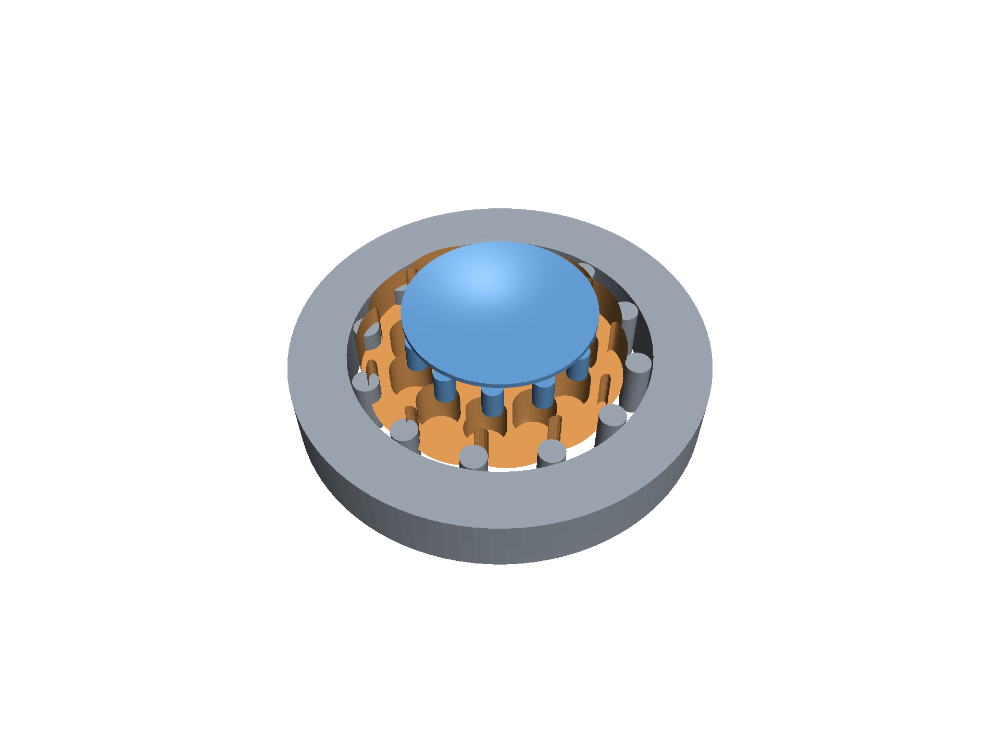 |

| Highlighted disc | Highlighted housing | Labeled |
|---|---|---|
|  | 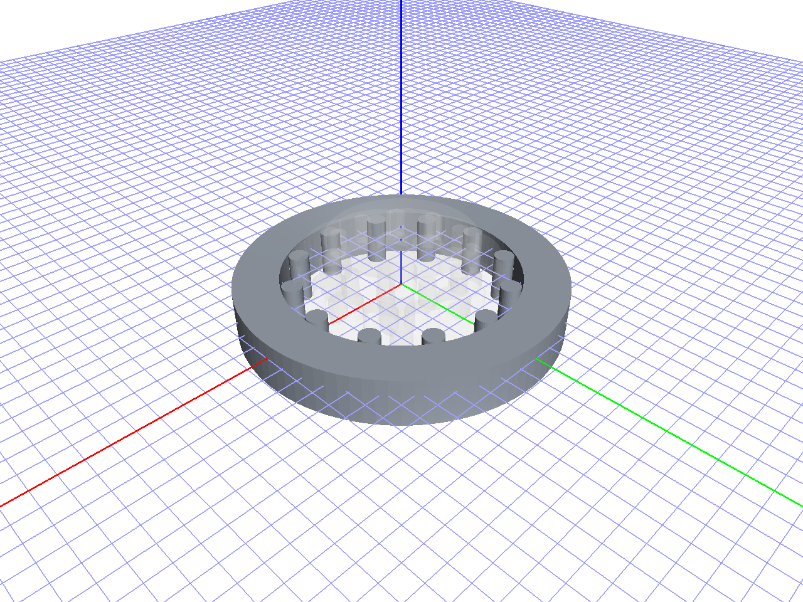 |  |

| Cross-section | Iteration |
|---|---|
|  |  |

Each named part has a distinct color: gray housing, bronze disc, gold input,
steel-blue output plate — picked so the four roles read at a glance.

The iteration GIF shows the real perception-loop story: the first attempt
arranged the output-pin holes too close together, so the disc came out as a
"flower" of overlapping voids. Re-rendering exposed the issue; widening the
output-hole circle fixed it.

**Try it.**

Locally (with jscad-mcp installed and connected to Claude):

```
take_standard_views file=examples/cycloidal_drive.jscad
list_parts          file=examples/cycloidal_drive.jscad
highlight           file=examples/cycloidal_drive.jscad part=cycloid_disc
label_parts         file=examples/cycloidal_drive.jscad
slice               file=examples/cycloidal_drive.jscad axis=z offset=4
```

In your browser:
[Open in openjscad.xyz](https://openjscad.xyz/?uri=https://raw.githubusercontent.com/caliperhq/jscad-mcp-example/main/examples/cycloidal_drive_bundled.jscad) — single-file bundle of `cycloidal_drive.jscad` + `lib/cycloid.js`, regenerated by `node scripts/bundle-examples.js`. openjscad.xyz can't follow relative requires against a GitHub raw URL.

**Parameters.**

- `pinCount` (default 12) — number of pins; reduction ratio = (N-1):1.
- `eccentricity` (mm, default 1.5) — how far off-center the disc rides.
- `discDiameter` (mm, default 60)
- `discThickness` (mm, default 8)
- `pinRadius` (mm, default 2.5)

---

## Cutaway 4-stroke engine

**What it is.** A single-cylinder 4-stroke engine, cut away on the +X face to
expose piston, conrod, crankshaft, valves, ports, and spark plug — all sized
from real bore/stroke/conrod-length parameters and positioned by slider-crank
kinematics at a tunable `crankAngle`. Each part is colored distinctively:
copper-orange piston, gray block + head + crankshaft, blue intake valve, red
exhaust valve, yellow spark plug, translucent blue/red ports for the airflow
paths.

**Why it's interesting for jscad-mcp.** The cutaway face shows every internal
feature at once. Because `crankAngle` is a parameter, sweeping it 0° → 360°
produces an animated crank rotation — the centerpiece GIF below. The
per-part coloring also makes the assembly self-explanatory without labels:
you can tell what each piece does at a glance.

**Screenshots.**

| Iso | Oblique |
|---|---|
|  | 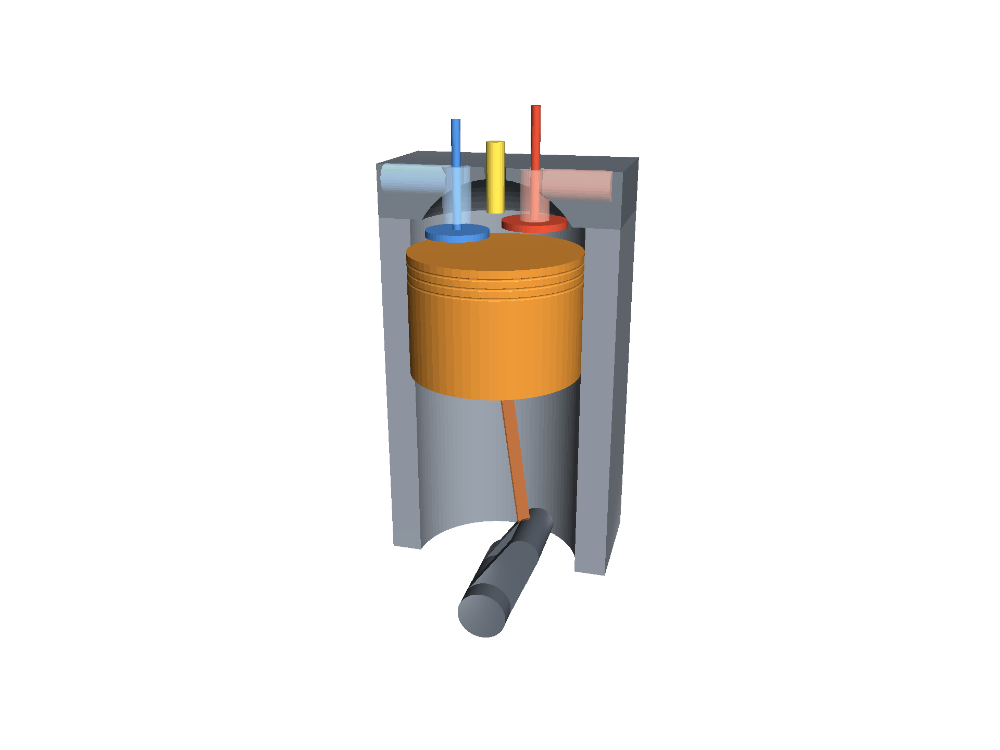 |

| Axial section | Top-down | Labeled |
|---|---|---|
| 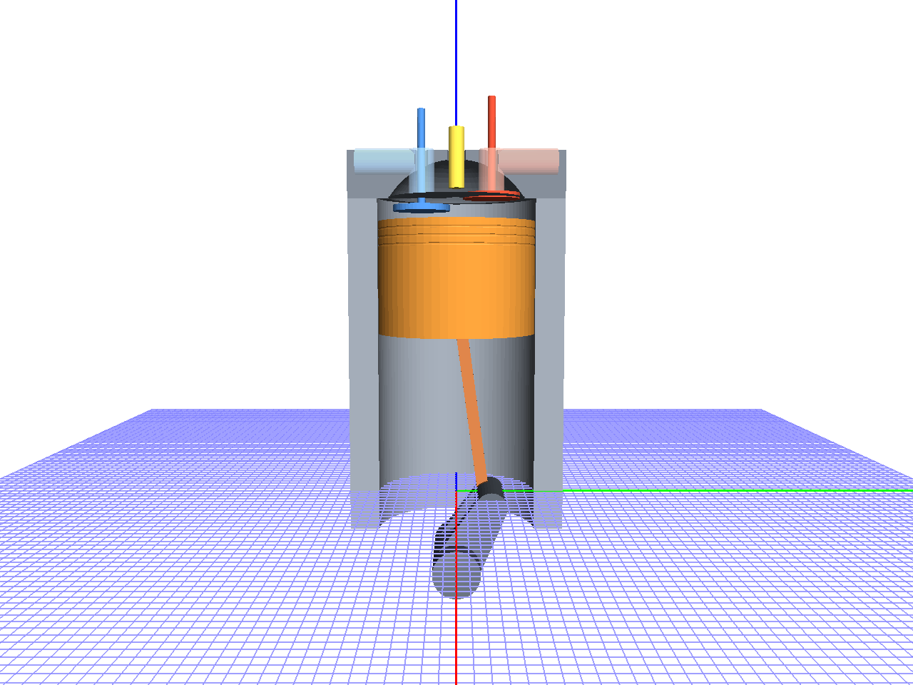 | 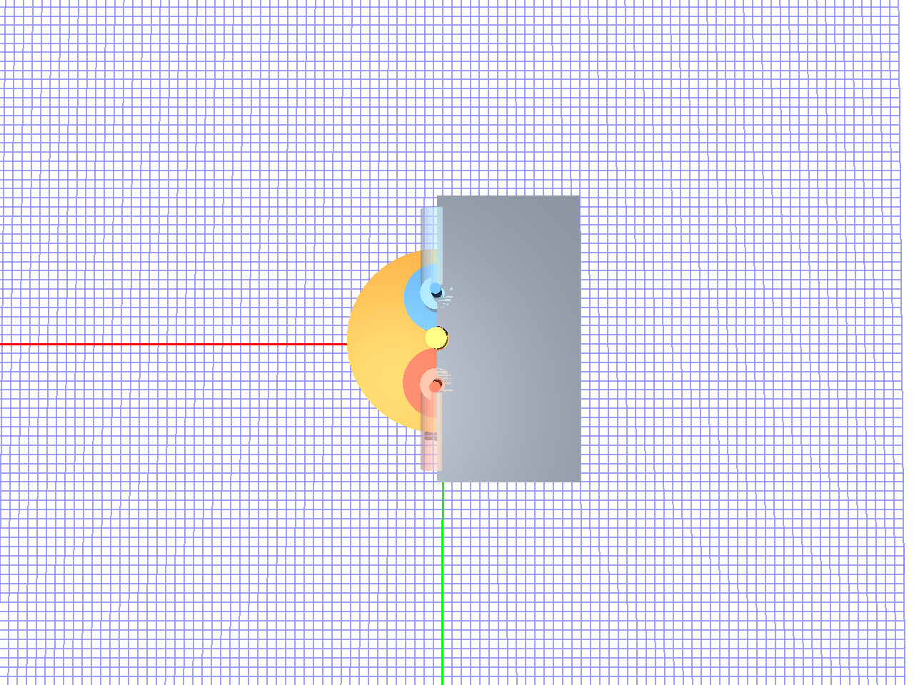 |  |

**Crank-angle sweep — the centerpiece:**


36 frames at 12 fps, crankAngle stepping 0° → 350° in 10° increments. Piston
travels TDC → BDC → TDC as the crank rotates; conrod sweeps through its arc
beside the bore. The slider-crank's non-linear motion (faster near mid-stroke,
slower at TDC/BDC) is visible at this frame density.

**One angle is one hypothesis — the conrod story.**

The first build of this demo shipped with a real geometry bug: the
connecting-rod I-beam shaft was rotated correctly but never translated to
anchor at the crank pin. Result: the big-end and small-end cylinders sat in
the right places, but the shaft connecting them floated off in space — lying
flat on the floor along the +y axis at z = 0, completely disconnected from
the engine. The bug was invisible in `iso` and the original side slice
(those were the only two angles the build session rendered) and immediately
obvious from a front view or with `highlight conrod`.

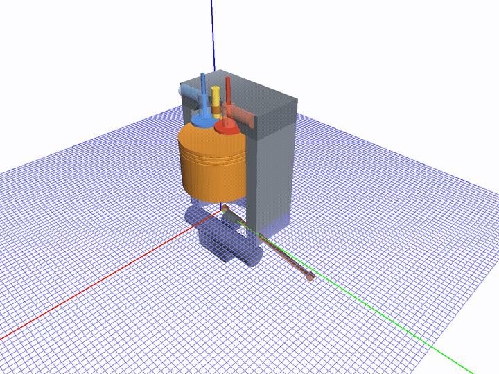

The iteration GIF above shows the discovery: looks-fine-from-iso → side
view exposes the floating conrod → highlight makes it unambiguous → fix →
multi-angle confirmation. Two bugs in the rod build had compounded —
`atan2(dy, dz)` instead of `atan2(dz, dy)` (so the rotation angle pointed
the shaft nearly horizontal instead of nearly vertical) plus the missing
anchor translate (so the shaft sat at world origin instead of at the big
end). Both were obvious *once we looked from the right angle*.

This is the second perception-loop story in this repo, after the cycloidal
overlapping-holes fix. Together they argue the same thing: one render is
one hypothesis. Multi-angle inspection isn't a polish step — it's how you
falsify your assumption that the model is correct.

**Try it.**

Locally:

```
take_standard_views file=demos/engine/assembly.js
slice               file=demos/engine/assembly.js axis=y offset=0
label_parts         file=demos/engine/assembly.js
```

In your browser:
[Open the bundled engine in openjscad.xyz](https://openjscad.xyz/?uri=https://raw.githubusercontent.com/caliperhq/jscad-mcp-example/main/demos/engine/engine_bundled.jscad)

The browser link uses `demos/engine/engine_bundled.jscad`, a single-file bundle
generated by `scripts/bundle-engine.js`. The canonical multi-file source is at
`demos/engine/`.

**Parameters.**

- `bore`, `stroke`, `conrodLength` (mm) — geometry of the slider-crank.
- `compressionRatio` (default 10) — drives combustion-chamber dome size.
- `crankAngle` (default 30°) — piston + conrod position. Sweep this to animate.
- `intakeValveOpen` / `exhaustValveOpen` (0..1) — valve lift fraction.

---

## Gyroid lattice cube

**What it is.** A cube filled with the triply-periodic minimal surface (gyroid):
`sin(x)cos(y) + sin(y)cos(z) + sin(z)cos(x) = 0`, thickened to a finite shell
and clipped to a cube. Marching cubes generates the mesh from the implicit
field; JSCAD's `polyhedron` primitive consumes it.

**Why it's interesting for jscad-mcp.** Implicit-surface design is invisible
until you render it. Wall-thickness tuning, sampling resolution, and the
relationship between cell size and bounding cube are all adjusted by *looking*.
The `slice` tool reveals the gyroid's famous interlocking S-curve
cross-section — a section you can't intuit from the formula alone.

The first attempt used `|f|-t` as the iso-function, which has a kink at f=0
that breaks marching cubes (non-manifold triangles). The render showed a solid
cube instead of a lattice. Switching to `f² - t²` (same iso-surface, smooth
field) immediately produced a coherent watertight mesh — exactly the
diagnose-and-fix loop the MCP perception story is about.

**Screenshots.**

| Iso | Slice Z | Slice X | Oblique |
|---|---|---|---|
|  |  |  |  |

**Iteration:**


Low resolution → thick walls → final tuning at moderate threshold and high
resolution.

**Try it.**

Locally:

```
take_standard_views file=examples/gyroid.jscad
slice               file=examples/gyroid.jscad axis=z offset=0
slice               file=examples/gyroid.jscad axis=x offset=0
```

In your browser:
[Open in openjscad.xyz](https://openjscad.xyz/?uri=https://raw.githubusercontent.com/caliperhq/jscad-mcp-example/main/examples/gyroid_bundled.jscad) — single-file bundle of `gyroid.jscad` + `lib/gyroid.js`, `lib/marching-cubes.js`, `lib/marching-cubes-tables.js`, regenerated by `node scripts/bundle-examples.js`.

**Parameters.**

- `cellSize` (default 10 mm) — gyroid period.
- `wallThreshold` (default 0.6) — solid where `|f(x,y,z)| < t`. Larger = thicker walls.
- `cubeSize` (default 40 mm) — outer cube.
- `resolution` (default 48) — marching cubes grid per axis. Higher = smoother, slower.

---

## Lofted vase

**What it is.** A parametric vase built by lofting a circular cross-section
through four radius control points (base → waist → hip → lip) along height,
with optional twist. The smoothstep-blended profile and continuous twist
produce a single watertight `extrudeFromSlices` surface — no booleans, no
revolution, just per-slice scale and rotation.

**Why it's interesting for jscad-mcp.** Loft surfaces look different from
every angle, and the slice silhouette is the clean way to see whether the
profile you wrote matches the profile you imagined. Tuning the four control
radii is exactly the kind of thing where a render is faster than mental
arithmetic — and the iso-vs-slice pairing makes the dependency between the
math and the result obvious.

**Screenshots.**

| Iso | Oblique |
|---|---|
|  | 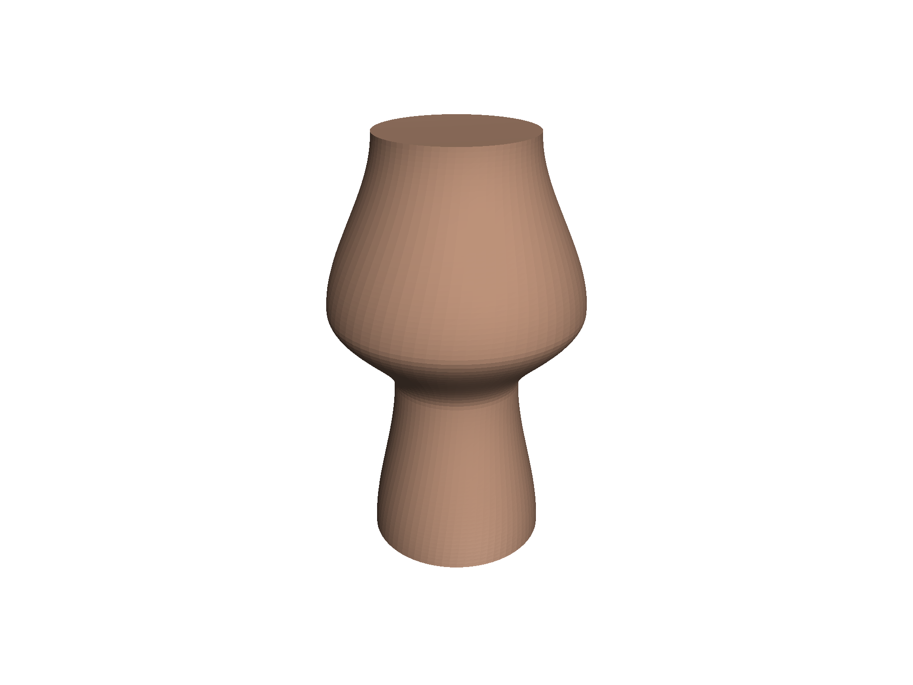 |

| Silhouette (slice x=0) | Top-down |
|---|---|
| 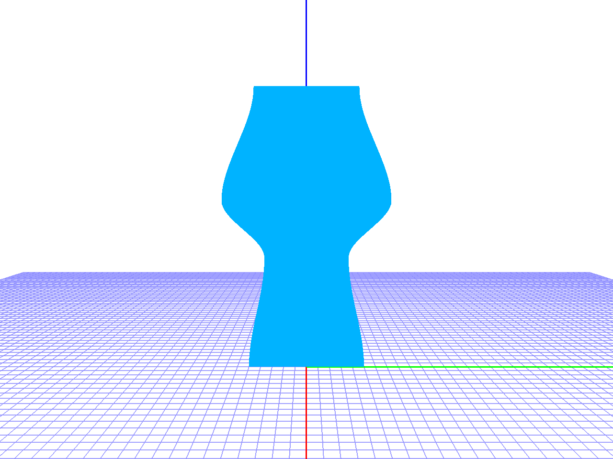 | 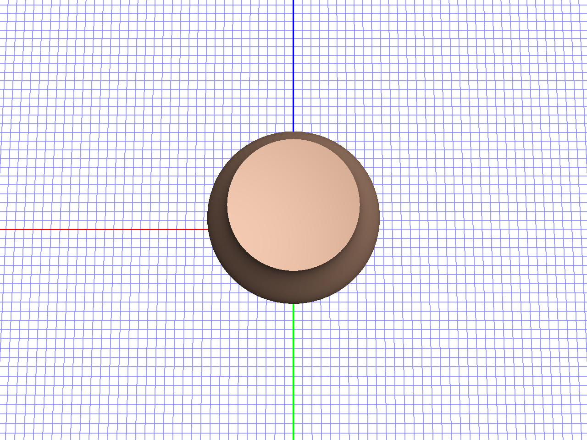 |

The slice at `x=0` shows the radius profile directly: foot, narrow waist,
wide hip, narrowing lip. Tuning a vase becomes "look at the silhouette,
nudge a control point, rerender."

**Try it.**

Locally:

```
take_image           file=examples/vase.jscad azimuth=45 elevation=15
slice                file=examples/vase.jscad axis=x offset=0
take_image           file=examples/vase.jscad azimuth=0 elevation=85
```

In your browser:
[Open in openjscad.xyz](https://openjscad.xyz/?uri=https://raw.githubusercontent.com/caliperhq/jscad-mcp-example/main/examples/vase_bundled.jscad)

**Parameters.**

- `height` (mm, default 120)
- `baseRadius`, `waistRadius`, `hipRadius`, `lipRadius` (mm) — four control points along the profile
- `twistDeg` (default 30) — accumulated twist around Z over full height
- `segments` (default 72) — cross-section polygon resolution
- `slices` (default 96) — number of height slices (loft fidelity)

---

## Voronoi-pattern panel

**What it is.** A flat panel with Voronoi-tessellated holes — a common
decorative / acoustic / structural pattern (speaker grilles, plant
trellises, cable-management panels). Sites are sampled deterministically
from a seeded PRNG, each Voronoi cell is computed by half-plane
intersection (O(N²), fine for the cell counts we use), shrunken inward
to leave wall material, then extruded and subtracted from a board.

**Why it's interesting for jscad-mcp.** Tuning a Voronoi pattern is a
classic "stare at the render, twiddle a parameter" exercise: cell count,
seed, gap, edge margin all interact, and the failure modes (tiny
slivers at the boundary, cells that collapse to nothing, walls so thin
they print as a single bead) are obvious in the iso render and
ambiguous in the parameter table.

**Screenshots.**

| Top-down | Iso |
|---|---|
| 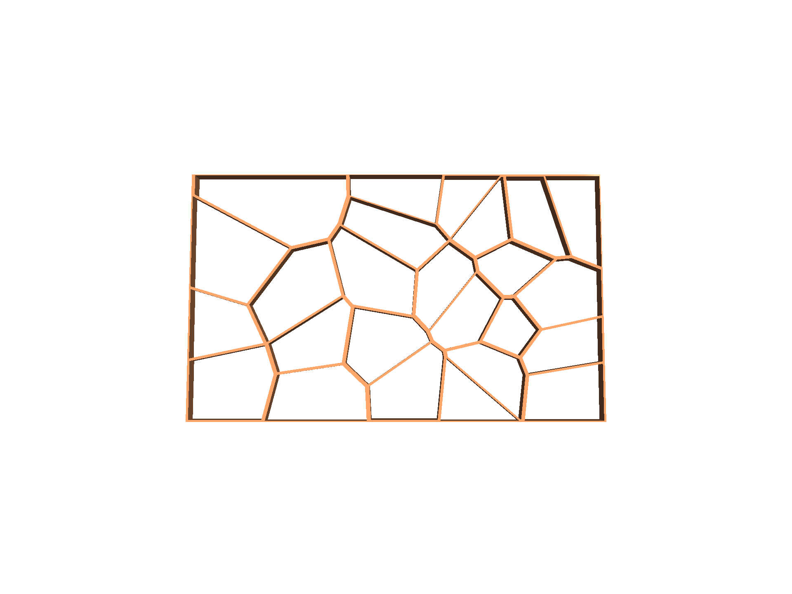 |  |

| Oblique (with grid) |
|---|
| 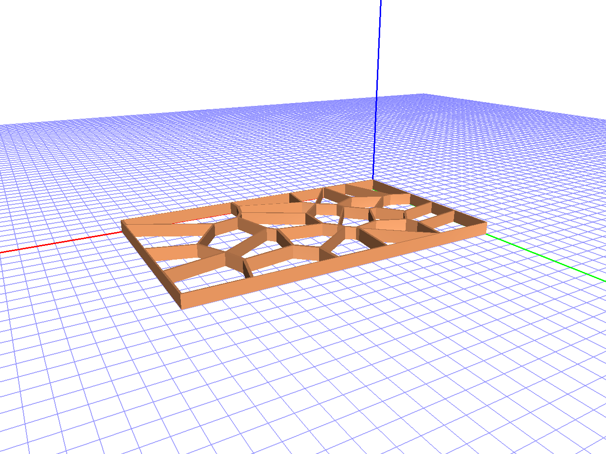 |

**Try it.**

Locally:

```
take_image           file=examples/voronoi_panel.jscad azimuth=0 elevation=85
take_image           file=examples/voronoi_panel.jscad azimuth=45 elevation=35
```

In your browser:
[Open in openjscad.xyz](https://openjscad.xyz/?uri=https://raw.githubusercontent.com/caliperhq/jscad-mcp-example/main/examples/voronoi_panel_bundled.jscad)

**Parameters.**

- `width`, `height`, `thickness` (mm) — board dimensions
- `cellCount` (default 25) — number of Voronoi sites
- `seed` (default 7) — PRNG seed; change for a different random pattern
- `margin` (mm, default 4) — keep sites this far inside the panel edge
- `gap` (mm, default 1.4) — wall thickness left between adjacent cells

---

## Threaded bolt + nut

**What it is.** An ISO-style metric hex bolt with a hex nut threaded
partway up the shaft. Both threads come from the same triangular
cross-section swept around Z by `extrudeHelical` — the bolt's external
thread runs from `minorRadius` outward to `majorRadius`; the nut's
internal thread is the same shape offset by a small radial clearance
and subtracted from a hex prism.

**Why it's interesting for jscad-mcp.** Threads are the canonical
"looks right from a parameter table, looks wrong when you render it"
geometry. Pitch sign, helix start angle, radial clearance, and the
nut-vs-bolt radial offset all have similar-looking failure modes
(thread doesn't engage, thread runs backward, thread is wedged into
the wall). The slice along the bolt axis tells you instantly whether
the crests and roots actually interlock.

**Screenshots.**

| Iso (hero) | Front | Half-section (slice y=0) |
|---|---|---|
|  | 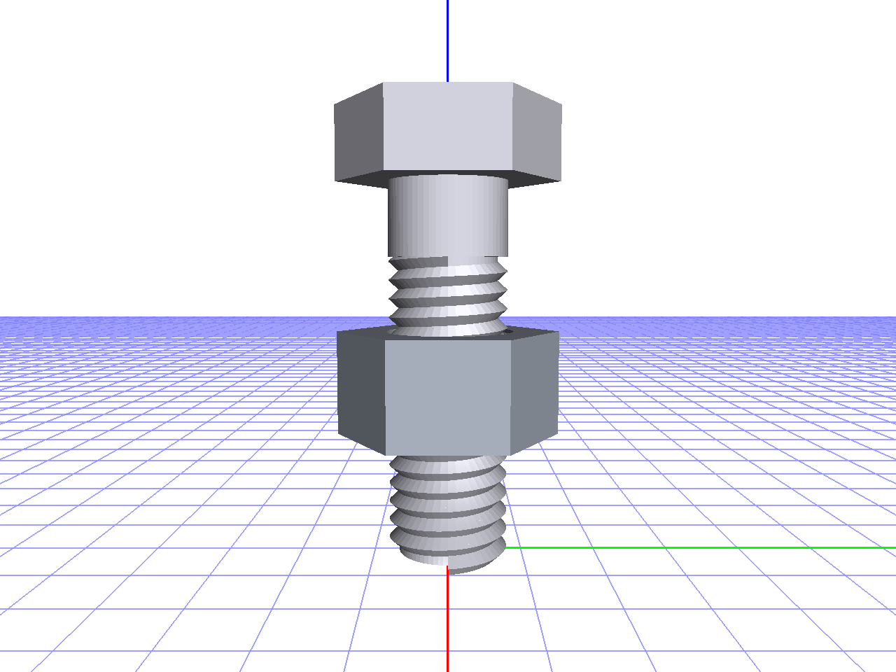 | 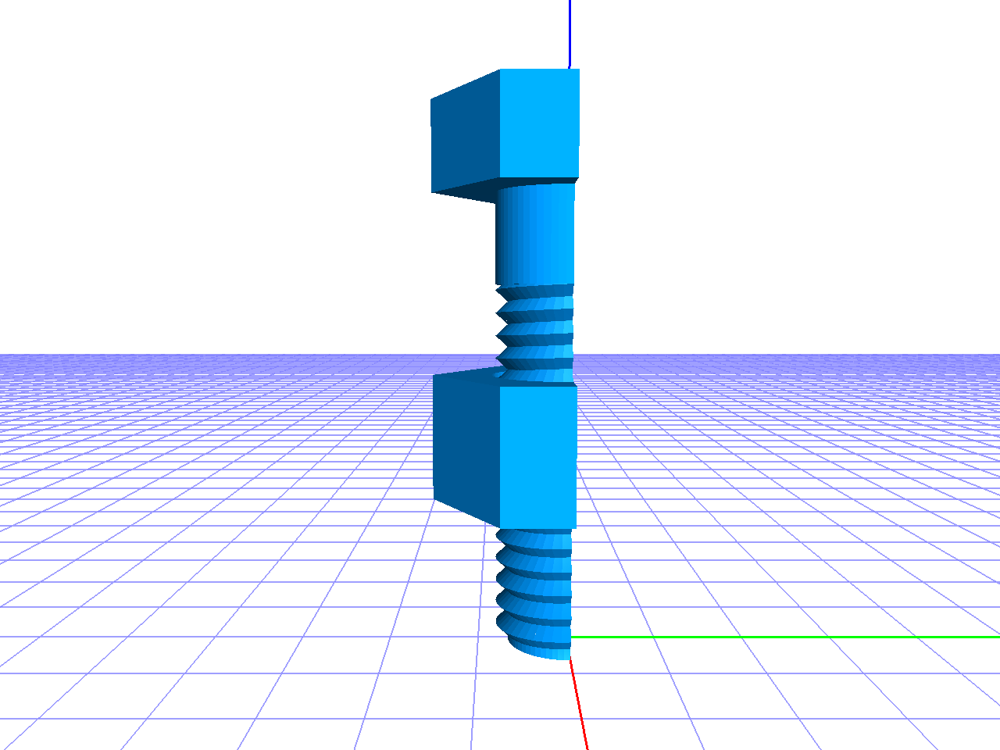 |

The slice cuts the assembly in half along the Y axis; the cyan cut
faces show the thread profile interleaved between bolt and nut.

**Try it.**

Locally:

```
take_image           file=examples/thread.jscad azimuth=30 elevation=15
take_image           file=examples/thread.jscad azimuth=90 elevation=5
```

In your browser:
[Open in openjscad.xyz](https://openjscad.xyz/?uri=https://raw.githubusercontent.com/caliperhq/jscad-mcp-example/main/examples/thread_bundled.jscad)

**Parameters.**

- `majorDiameter` (mm, default 8) — bolt major (crest) diameter
- `pitch` (mm, default 1.25) — axial distance per thread
- `threadLength`, `shankLength` (mm) — bolt geometry
- `headHeight`, `headAcross` (mm) — hex head
- `nutHeight`, `nutAcross` (mm) — hex nut
- `nutPosition` (mm) — z height of the nut bottom
- `clearance` (mm, default 0.2) — radial clearance between bolt-major and nut-minor

> **Caveat.** This is a visual demo of the technique, not a printable or
> turnable fastener. Real ISO threads have truncated crests and roots
> and a tighter tolerance budget.

---

## Spur gear pair

**What it is.** Two meshing spur gears of equal module, different tooth
counts. Tooth profile is a smooth cosine modulation of radius around
each pitch circle — not a true involute, but close enough that the
geometry of meshing (center distance = r_pA + r_pB, second gear phased
so its valleys line up with the first gear's peaks at the line of
centers) is honest.

**Why it's interesting for jscad-mcp.** Mesh quality is something
that's instantly obvious from a top-down render and slightly tedious
to reason about analytically. The "did I phase the second gear by
π/N or 0?" question gets settled in one render. Tooth interference,
wrong center distance, or off-by-one rotations all jump out the
moment you look at the pair from directly above.

**Screenshots.**

| Top-down | Iso (hero) | Oblique (with grid) |
|---|---|---|
| 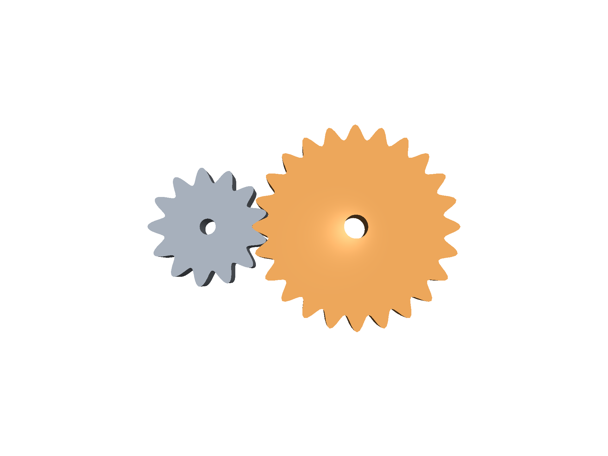 |  | 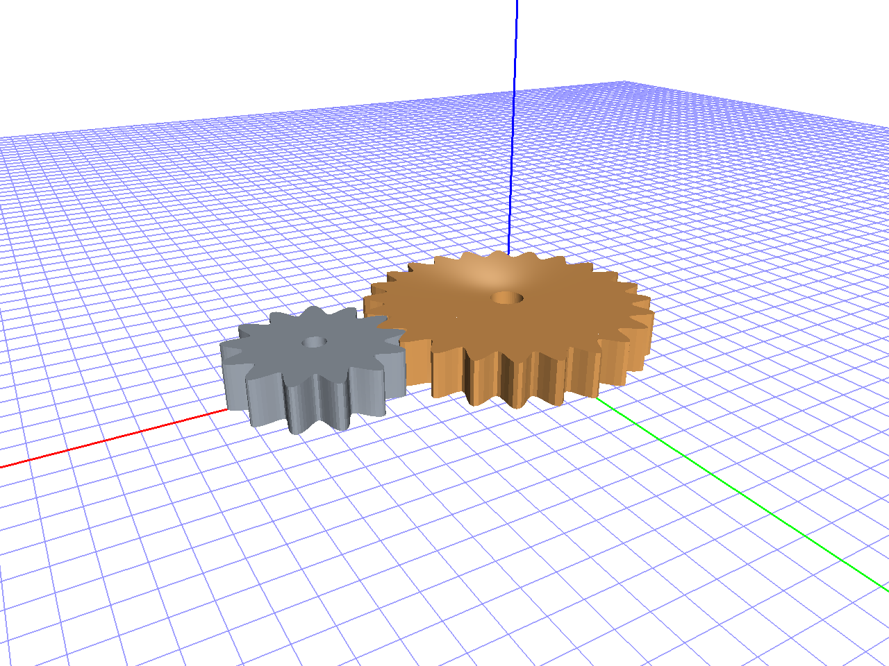 |

**Try it.**

Locally:

```
take_image           file=examples/gear_pair.jscad azimuth=0 elevation=85
take_image           file=examples/gear_pair.jscad azimuth=35 elevation=35
```

In your browser:
[Open in openjscad.xyz](https://openjscad.xyz/?uri=https://raw.githubusercontent.com/caliperhq/jscad-mcp-example/main/examples/gear_pair_bundled.jscad)

**Parameters.**

- `module` (mm, default 2) — tooth size; pitch radius = module × N / 2
- `teethA`, `teethB` — tooth counts of the two gears
- `thickness` (mm) — face width
- `boreA`, `boreB` (mm) — shaft hole diameters

> **Caveat.** Cosine teeth are not involute teeth — they roll with a
> small velocity ripple and don't carry torque as well. For a real
> drivetrain, generate proper involute flanks instead.

---

## Snap-fit parametric box

**What it is.** A tray-style box with a press-on lid. The box has small
wedge protrusions on its long walls; the lid's downward skirt has
matching dimples cut into its inner face. With the lid closed
(`lidLifted = 0`), the wedges sit inside the dimples. With the lid
lifted, the parts separate so the snap features are visible.

**Why it's interesting for jscad-mcp.** Snap-fit design is all
tolerance. `clearance` between the box outer wall and the lid skirt
inner wall determines whether the lid jams, snaps cleanly, or rattles.
Wedge depth and dimple depth set the engagement force. None of this is
intuitable from numbers in a table — render-and-twiddle is the design
loop.

**Screenshots.**

| Closed | Exploded (lid lifted) |
|---|---|
| 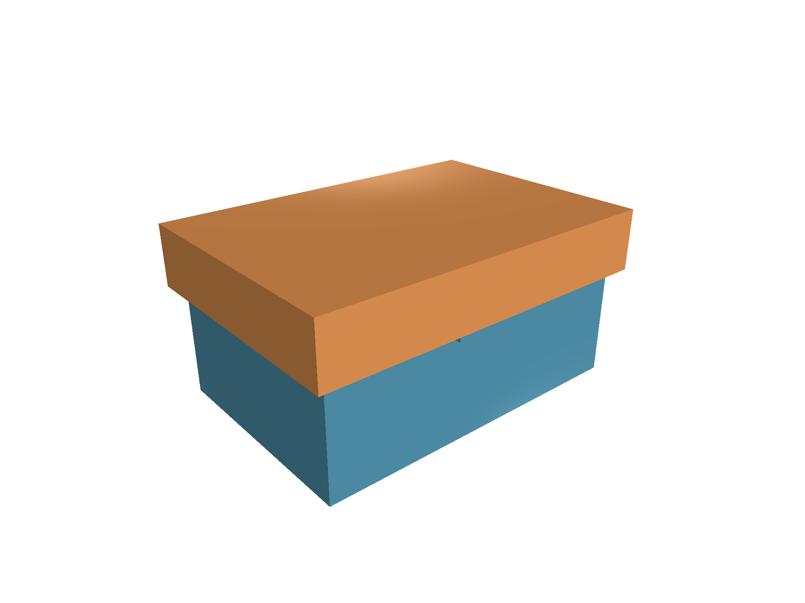 |  |

The exploded view shows the wedge on the box's long wall (small bump
near the top of the box's front face) and the matching dimple on the
inside of the lid's skirt.

**Try it.**

Locally:

```
take_image  file=examples/snap_box.jscad azimuth=40 elevation=25
take_image  code='<inline override of lidLifted=0>'   # closed view
```

In your browser:
[Open in openjscad.xyz](https://openjscad.xyz/?uri=https://raw.githubusercontent.com/caliperhq/jscad-mcp-example/main/examples/snap_box_bundled.jscad)

**Parameters.**

- `width`, `depth`, `height` (mm) — outer box dimensions
- `wallThickness`, `floorThickness`, `lidThickness`, `lidSkirtHeight` (mm)
- `snapZ`, `snapWidth`, `snapDepth` (mm) — wedge geometry
- `clearance` (mm) — radial gap between box outer wall and lid skirt
- `lidLifted` (mm) — z offset for the exploded view (0 = closed)

---

## Sliding caliper jaws

**What it is.** A stylized vernier caliper: a long beam, a fixed jaw at
one end, and a movable jaw that slides along the beam. The
`jawExtension` parameter is the inside-face distance between the two
jaws — sweep it to animate the caliper opening and closing.

**Why it's interesting for jscad-mcp.** Animated mechanisms are where
parameter sweeps shine. The crank-sweep on the engine showed
slider-crank kinematics; this one is simpler (pure translation) but
makes the value of "GIF, not still" obvious — the geometry doesn't
look like a caliper until you see it move.

**Screenshots.**

| Iso (hero) |
|---|
| 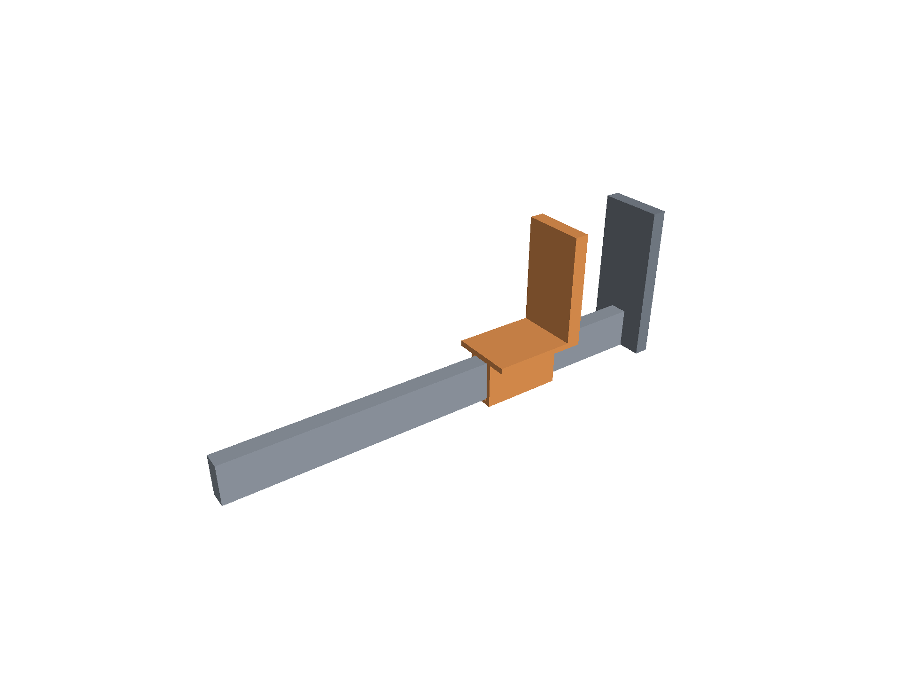 |

**Jaw extension sweep (36 frames):**


`jawExtension` ramps from 5 mm to 110 mm over 36 frames at 12 fps.

**Try it.**

Locally:

```
take_image  file=examples/caliper.jscad azimuth=35 elevation=30
```

In your browser:
[Open in openjscad.xyz](https://openjscad.xyz/?uri=https://raw.githubusercontent.com/caliperhq/jscad-mcp-example/main/examples/caliper_bundled.jscad)

**Parameters.**

- `beamLength`, `beamWidth`, `beamHeight` (mm) — beam dimensions
- `jawBlade`, `jawSpan`, `jawY` (mm) — jaw geometry
- `sliderLength`, `sliderClearance` (mm) — movable-jaw slider sleeve
- `jawExtension` (mm) — opening between the two inner jaw faces

---

## Heatsink fin array

**What it is.** A rectangular base plate with N parallel fins. Fins
are equally spaced across the base width with a small edge margin.
Pure cuboid arithmetic — no booleans needed; just `union` of a base
and a generated fin array.

**Why it's interesting for jscad-mcp.** Heatsinks are the canonical
"how many fins fit?" parameter exercise. Push `finCount` up and the
inter-fin gap shrinks; below the printer's wall width the fins merge
into a solid block in the slice view, even though the parameter table
still says they're separate. This is the cousin of the GPU waterblock
below — same kind of geometry, more constrained tolerance budget.

**Screenshots.**

| Iso | Slice (between fins) |
|---|---|
|  | 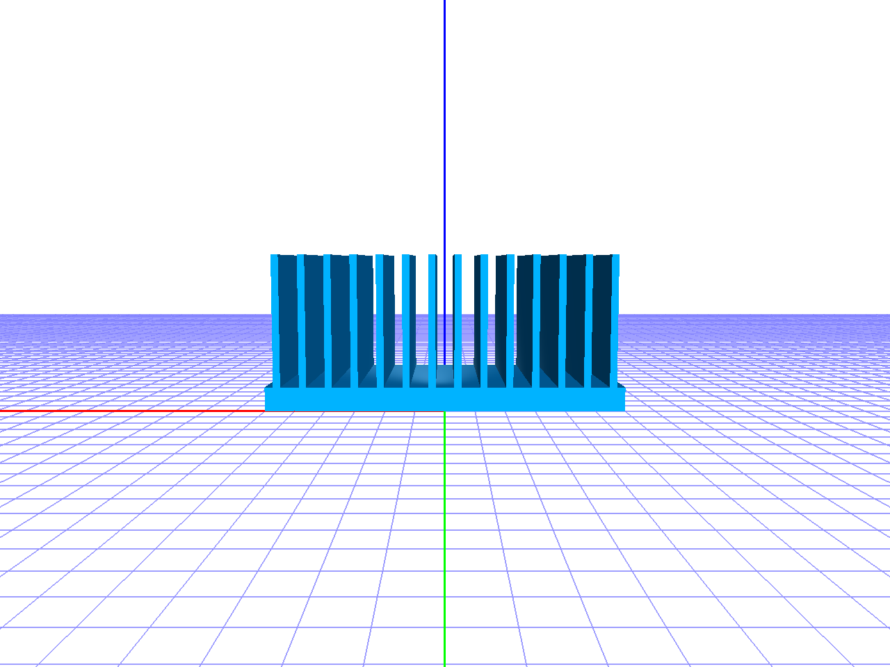 |

The slice cuts at `y = 0` (perpendicular to the fins) so each fin
appears as a thin vertical bar standing on the base. Try bumping
`finCount` from 14 toward 30 and watch the bars merge.

**Try it.**

Locally:

```
take_image  file=examples/heatsink.jscad azimuth=35 elevation=25
slice       file=examples/heatsink.jscad axis=y offset=0
```

In your browser:
[Open in openjscad.xyz](https://openjscad.xyz/?uri=https://raw.githubusercontent.com/caliperhq/jscad-mcp-example/main/examples/heatsink_bundled.jscad)

**Parameters.**

- `baseWidth`, `baseDepth`, `baseThickness` (mm) — base plate
- `finCount` — number of parallel fins
- `finHeight`, `finThickness` (mm) — fin geometry
- `finMargin` (mm) — distance from base edge to the outermost fin

---

## GPU waterblock

The `jscad-mcp` server was developed alongside a real engineering project: a
full-cover waterblock for an NVIDIA RTX 5060 Ti GPU. The waterblock features a
copper cold plate with 0.5 mm machined fin channels, POM upper/lower top
plates, a VRM bridge plate, copper backplate, and three wrap-around bridge
bars — all designed against a measured PCB.

Coordinate system, tolerance budget, fin geometry, and O-ring routing were all
developed using the perception loop: render → inspect → adjust → re-render.
The waterblock source is kept private (it's an in-flight build); this section
documents the project class as a benchmark for what jscad-mcp can support.

---

## Postscript: estimates vs reality

During the brainstorming phase, the assistant (Claude) sized each demo:


> **Tier 1** (eye candy, **~1hr**): A — Gyroid lattice cube.
> **Tier 2** (mechanical, **~half day**): C — Cycloidal drive.
> **Tier 3** (assembly cutaway, **~half day**): D — Cutaway 4-stroke engine.

Roughly nine hours of estimated work.

The actual durations, measured from the first to last commit per demo on
this branch's git log:

| Demo | Estimated | Actual | Notes |
|------|-----------|--------|-------|
| Cycloidal drive | ~4 hr | **49 min** | Includes the overlapping-holes geometry fix |
| Engine cutaway | ~4 hr | **24 min** | Includes per-part colors and 12-frame crank sweep |
| Gyroid lattice | ~1 hr | **15 min** | Includes the marching-cubes \|f\| → f² iso-function fix |
| **Total demos** | **~9 hr** | **~88 min** | ≈ 6× under estimate |

(Reproduce: `git log --reverse --pretty=format:"%ai %s" | grep -E "feat\(<demo>\)"`.)

Everything in this repo — spec, plan, three demos with parameter UIs, unit
tests for the cycloid + marching-cubes math, a single-file bundler for the
engine, screenshots, the engine crank-sweep GIF, two iteration GIFs,
EXAMPLES.md — was built in **one session**, with substantial unplanned
detours along the way:

- Diagnosing and rebuilding the jscad-mcp native bindings for Node 24 (a
  documented patch in the upstream README but still a real interruption).
- Installing `media-libs/exiftool` for the EXIF scrub step.
- A geometry bug in the cycloidal disc (output-pin holes overlapping into a
  flower void) and a marching-cubes failure on the gyroid (the `|f|-t`
  kink at f=0 producing non-manifold triangles). Both fixes are visible in
  the iteration GIFs.

The estimates assumed human-developer pace. The perception loop — Claude
writing the geometry, Claude rendering it, Claude seeing what came out and
adjusting — turns out to be a major accelerator. That, more than any
individual demo, is the story this repo tells.

---

Want to suggest a new demo? Open an issue.
