# jscad-mcp examples — walkthroughs

Each section covers one demo: what it is, why visual feedback matters for it,
screenshots from the iteration loop, and how to try it locally or in your browser.

## Contents

1. [Cycloidal drive reducer](#cycloidal-drive-reducer) — named parts + highlight
2. [Cutaway 4-stroke engine](#cutaway-4-stroke-engine) — slice (cross-section)
3. [Gyroid lattice cube](#gyroid-lattice-cube) — slice (TPMS section)
4. [GPU waterblock](#gpu-waterblock) — real engineering reference

---

## Cycloidal drive reducer

**What it is.** A three-part cycloidal speed reducer: an eccentric input shaft,
a cycloidal disc, and a fixed pin housing with N rollers. The disc has N-1
lobes; the drive ratio is (N-1):1. The cycloidal profile is generated by an
analytic parametric equation — small sign or rolling-radius mistakes produce a
curve that *looks* similar but doesn't mesh.

**Why it's interesting for jscad-mcp.** This is exactly the kind of design
where the perception loop earns its keep: you write the profile equation, render
it, and instantly see whether the curve is a working hypocycloid or a degenerate
self-intersecting shape. The four named parts make this the showcase demo for
`list_parts`, `highlight`, and `label_parts`.

**Screenshots.**

| Iso | Highlighted disc | Highlighted housing |
|---|---|---|
| 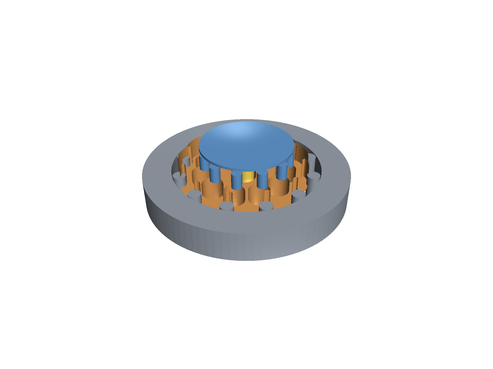 | 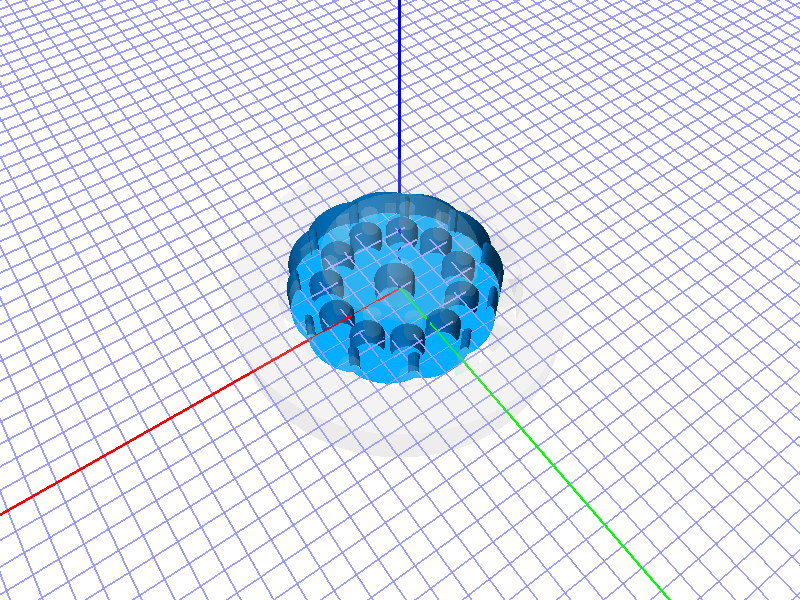 | 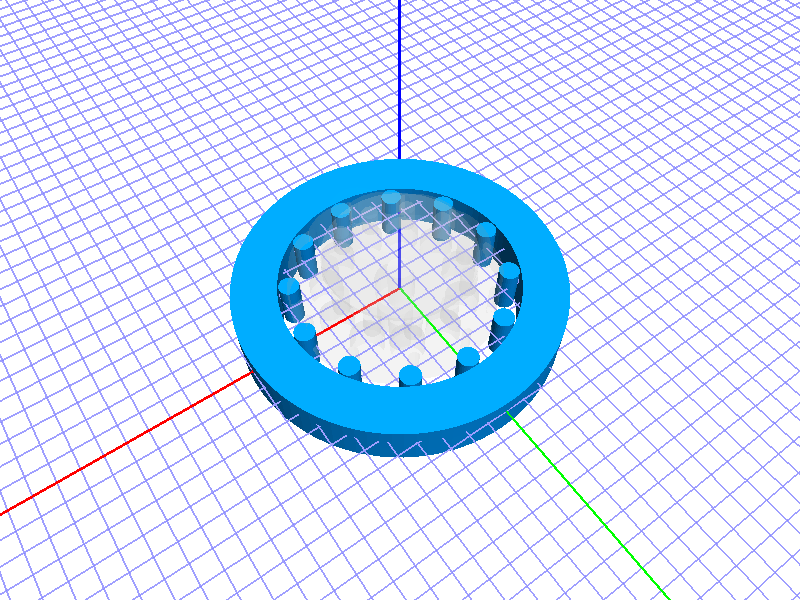 |

| Labeled | Cross-section | Iteration |
|---|---|---|
| 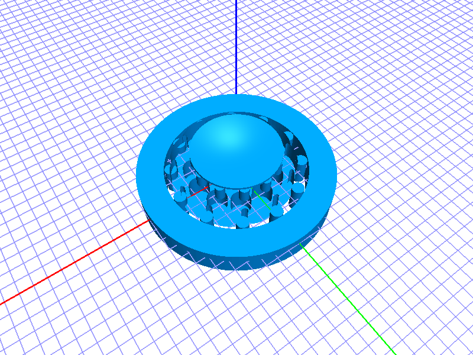 | 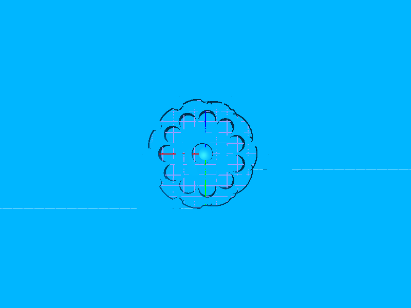 | 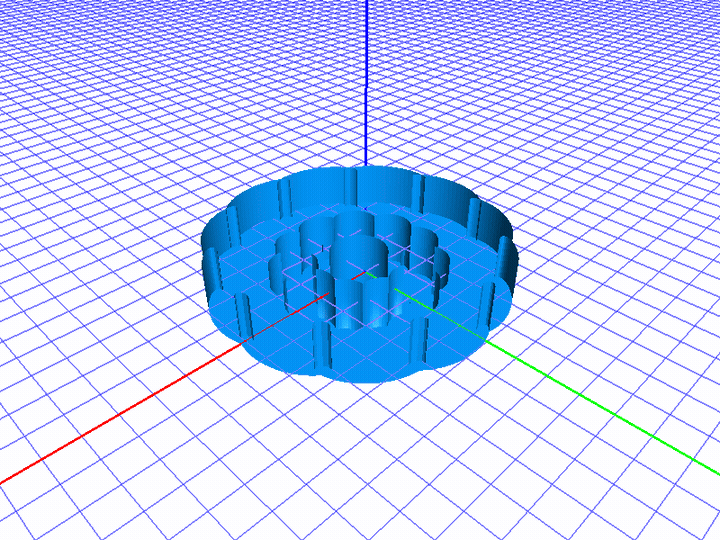 |

The iteration GIF shows the real perception-loop story: the first attempt
arranged the output-pin holes too close together, so the disc came out as a
"flower" of overlapping voids. Re-rendering exposed the issue; widening the
output-hole circle fixed it.

**Try it.**

Locally (with jscad-mcp installed and connected to Claude):

```
take_standard_views file=examples/cycloidal_drive.jscad
list_parts          file=examples/cycloidal_drive.jscad
highlight           file=examples/cycloidal_drive.jscad part=cycloid_disc
label_parts         file=examples/cycloidal_drive.jscad
slice               file=examples/cycloidal_drive.jscad axis=z offset=4
```

In your browser:
[Open in openjscad.xyz](https://openjscad.xyz/?uri=https://raw.githubusercontent.com/caliperhq/jscad-mcp-example/main/examples/cycloidal_drive.jscad)

**Parameters.**

- `pinCount` (default 12) — number of pins; reduction ratio = (N-1):1.
- `eccentricity` (mm, default 1.5) — how far off-center the disc rides.
- `discDiameter` (mm, default 60)
- `discThickness` (mm, default 8)
- `pinRadius` (mm, default 2.5)

---

## Cutaway 4-stroke engine

**What it is.** A single-cylinder 4-stroke engine, cut away on the +X face to
expose piston, conrod, crankshaft, valves, ports, and spark plug — all sized
from real bore/stroke/conrod-length parameters and positioned by slider-crank
kinematics at a tunable `crankAngle`. Each part is colored distinctively:
copper-orange piston, gray block + head + crankshaft, blue intake valve, red
exhaust valve, yellow spark plug, translucent blue/red ports for the airflow
paths.

**Why it's interesting for jscad-mcp.** The cutaway face shows every internal
feature at once. Because `crankAngle` is a parameter, sweeping it 0° → 360°
produces an animated crank rotation — the centerpiece GIF below. The
per-part coloring also makes the assembly self-explanatory without labels:
you can tell what each piece does at a glance.

**Screenshots.**

| Iso (cutaway) | Axial section |
|---|---|
| 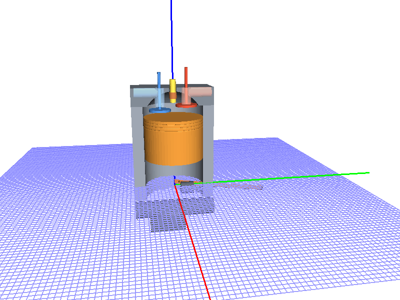 |  |

| Top-down | Labeled |
|---|---|
| 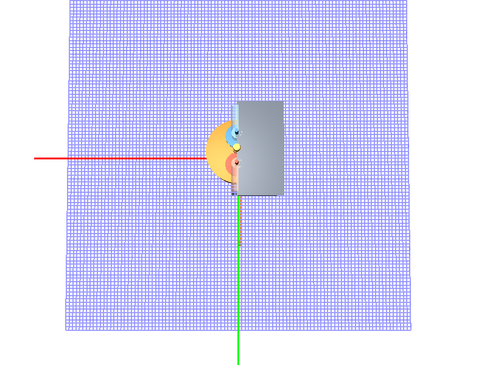 | 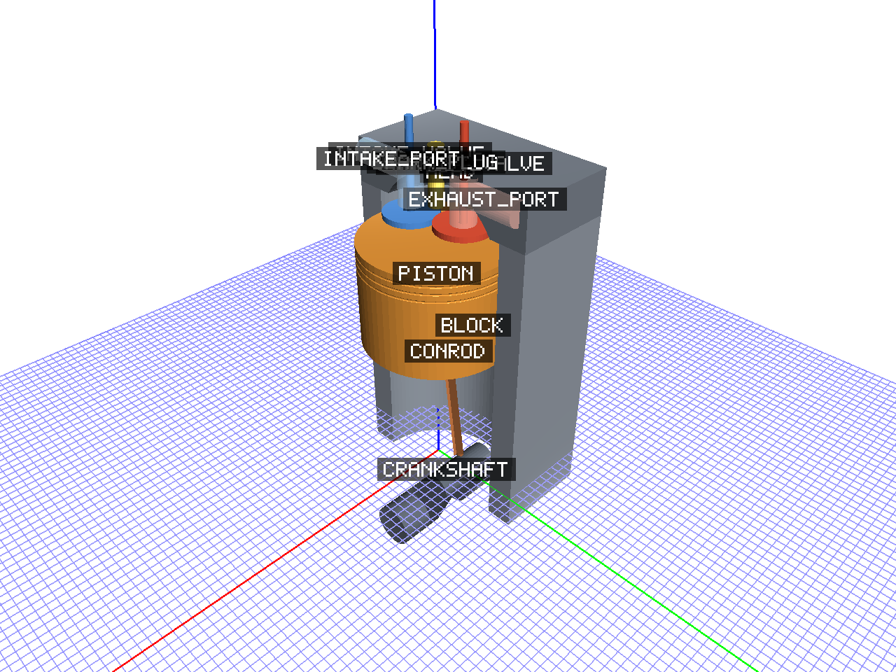 |

**Crank-angle sweep — the centerpiece:**

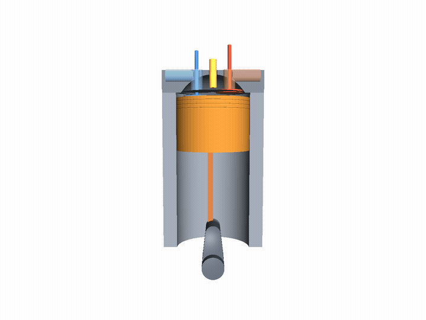

12 frames at 8 fps, crankAngle stepping 0° → 330° in 30° increments. Piston
travels TDC → BDC → TDC as the crank rotates; conrod sweeps through its arc
beside the bore.

**Try it.**

Locally:

```
take_standard_views file=demos/engine/assembly.js
slice               file=demos/engine/assembly.js axis=y offset=0
label_parts         file=demos/engine/assembly.js
```

In your browser:
[Open the bundled engine in openjscad.xyz](https://openjscad.xyz/?uri=https://raw.githubusercontent.com/caliperhq/jscad-mcp-example/main/demos/engine/engine_bundled.jscad)

The browser link uses `demos/engine/engine_bundled.jscad`, a single-file bundle
generated by `scripts/bundle-engine.js`. The canonical multi-file source is at
`demos/engine/`.

**Parameters.**

- `bore`, `stroke`, `conrodLength` (mm) — geometry of the slider-crank.
- `compressionRatio` (default 10) — drives combustion-chamber dome size.
- `crankAngle` (default 30°) — piston + conrod position. Sweep this to animate.
- `intakeValveOpen` / `exhaustValveOpen` (0..1) — valve lift fraction.

---

## Gyroid lattice cube

**What it is.** A cube filled with the triply-periodic minimal surface (gyroid):
`sin(x)cos(y) + sin(y)cos(z) + sin(z)cos(x) = 0`, thickened to a finite shell
and clipped to a cube. Marching cubes generates the mesh from the implicit
field; JSCAD's `polyhedron` primitive consumes it.

**Why it's interesting for jscad-mcp.** Implicit-surface design is invisible
until you render it. Wall-thickness tuning, sampling resolution, and the
relationship between cell size and bounding cube are all adjusted by *looking*.
The `slice` tool reveals the gyroid's famous interlocking S-curve
cross-section — a section you can't intuit from the formula alone.

The first attempt used `|f|-t` as the iso-function, which has a kink at f=0
that breaks marching cubes (non-manifold triangles). The render showed a solid
cube instead of a lattice. Switching to `f² - t²` (same iso-surface, smooth
field) immediately produced a coherent watertight mesh — exactly the
diagnose-and-fix loop the MCP perception story is about.

**Screenshots.**

| Iso | Slice Z | Slice X | Oblique |
|---|---|---|---|
| 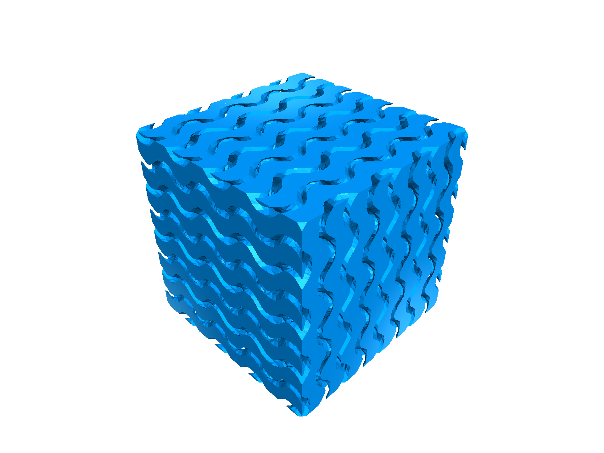 | 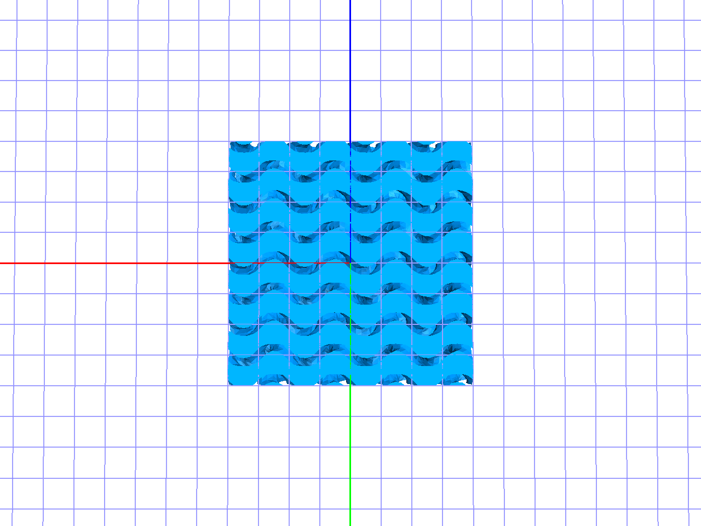 | 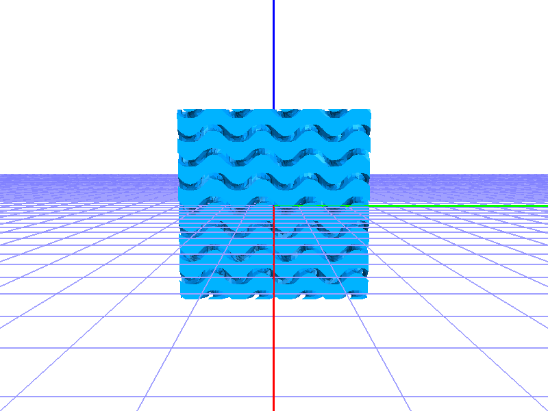 | 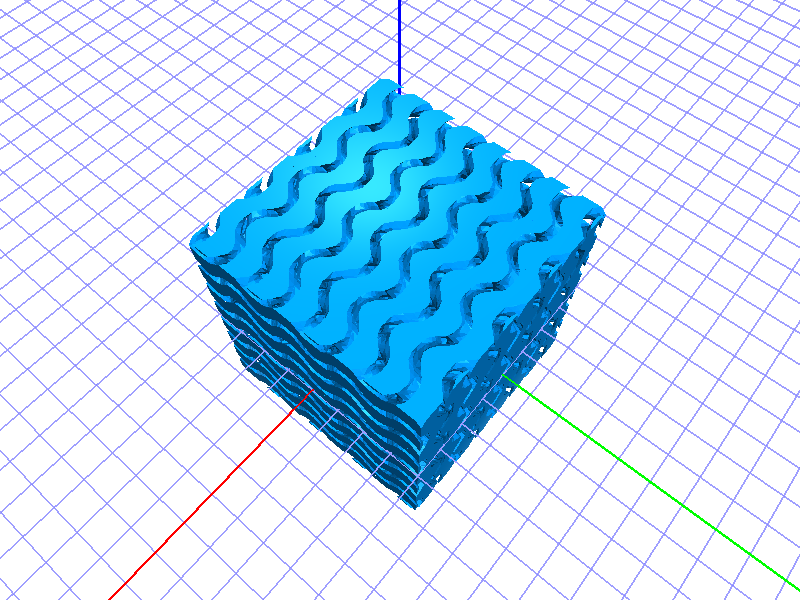 |

**Iteration:**

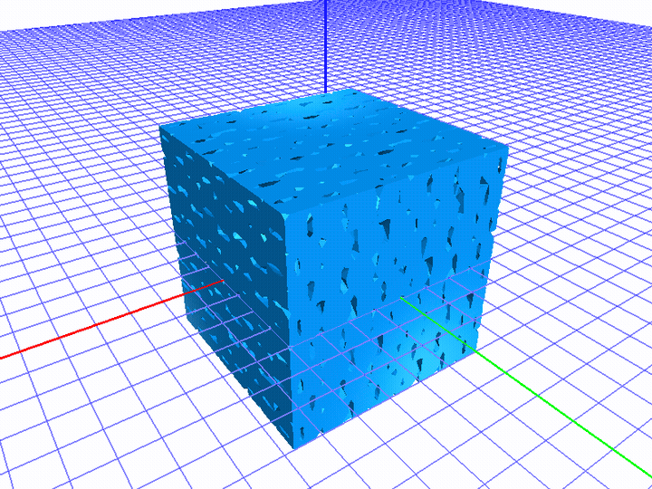

Low resolution → thick walls → final tuning at moderate threshold and high
resolution.

**Try it.**

Locally:

```
take_standard_views file=examples/gyroid.jscad
slice               file=examples/gyroid.jscad axis=z offset=0
slice               file=examples/gyroid.jscad axis=x offset=0
```

In your browser:
[Open in openjscad.xyz](https://openjscad.xyz/?uri=https://raw.githubusercontent.com/caliperhq/jscad-mcp-example/main/examples/gyroid.jscad)

**Parameters.**

- `cellSize` (default 10 mm) — gyroid period.
- `wallThreshold` (default 0.6) — solid where `|f(x,y,z)| < t`. Larger = thicker walls.
- `cubeSize` (default 40 mm) — outer cube.
- `resolution` (default 48) — marching cubes grid per axis. Higher = smoother, slower.

---

## GPU waterblock

The `jscad-mcp` server was developed alongside a real engineering project: a
full-cover waterblock for an NVIDIA RTX 5060 Ti GPU. The waterblock features a
copper cold plate with 0.5 mm machined fin channels, POM upper/lower top
plates, a VRM bridge plate, copper backplate, and three wrap-around bridge
bars — all designed against a measured PCB.

Coordinate system, tolerance budget, fin geometry, and O-ring routing were all
developed using the perception loop: render → inspect → adjust → re-render.
The waterblock source is kept private (it's an in-flight build); this section
documents the project class as a benchmark for what jscad-mcp can support.

---

## Postscript: estimates vs reality

During the brainstorming phase, the assistant (Claude) sized each demo:

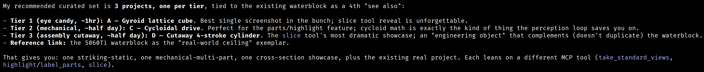

> **Tier 1** (eye candy, **~1hr**): A — Gyroid lattice cube.
> **Tier 2** (mechanical, **~half day**): C — Cycloidal drive.
> **Tier 3** (assembly cutaway, **~half day**): D — Cutaway 4-stroke engine.

Roughly nine hours of estimated work.

The actual durations, measured from the first to last commit per demo on
this branch's git log:

| Demo | Estimated | Actual | Notes |
|------|-----------|--------|-------|
| Cycloidal drive | ~4 hr | **49 min** | Includes the overlapping-holes geometry fix |
| Engine cutaway | ~4 hr | **24 min** | Includes per-part colors and 12-frame crank sweep |
| Gyroid lattice | ~1 hr | **15 min** | Includes the marching-cubes \|f\| → f² iso-function fix |
| **Total demos** | **~9 hr** | **~88 min** | ≈ 6× under estimate |

(Reproduce: `git log --reverse --pretty=format:"%ai %s" | grep -E "feat\(<demo>\)"`.)

Everything in this repo — spec, plan, three demos with parameter UIs, unit
tests for the cycloid + marching-cubes math, a single-file bundler for the
engine, screenshots, the engine crank-sweep GIF, two iteration GIFs,
EXAMPLES.md — was built in **one session**, with substantial unplanned
detours along the way:

- Diagnosing and rebuilding the jscad-mcp native bindings for Node 24 (a
  documented patch in the upstream README but still a real interruption).
- Installing `media-libs/exiftool` for the EXIF scrub step.
- A geometry bug in the cycloidal disc (output-pin holes overlapping into a
  flower void) and a marching-cubes failure on the gyroid (the `|f|-t`
  kink at f=0 producing non-manifold triangles). Both fixes are visible in
  the iteration GIFs.

The estimates assumed human-developer pace. The perception loop — Claude
writing the geometry, Claude rendering it, Claude seeing what came out and
adjusting — turns out to be a major accelerator. That, more than any
individual demo, is the story this repo tells.

---

Want to suggest a new demo? Open an issue.
