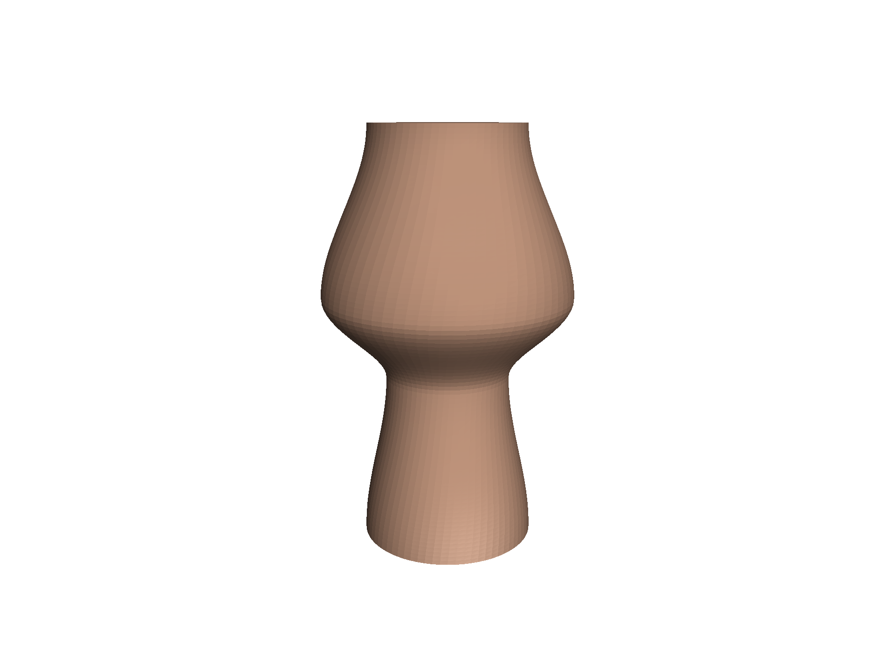
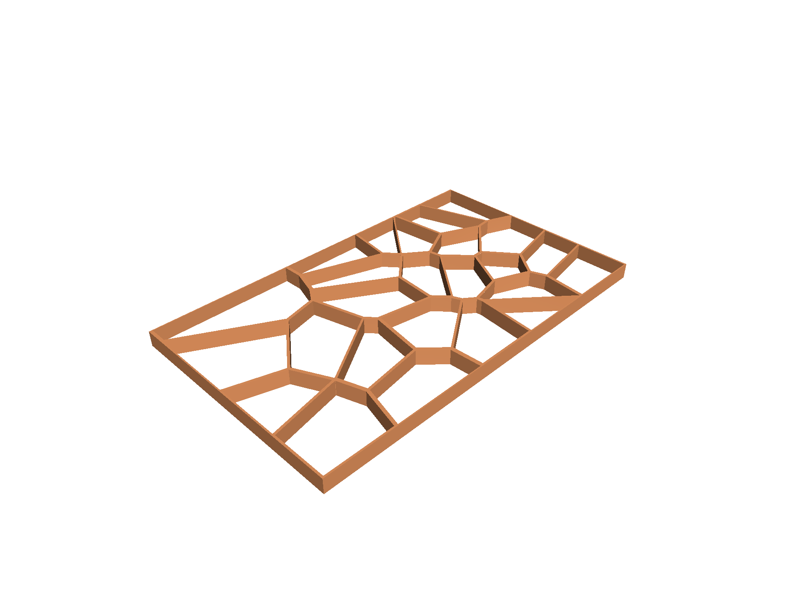
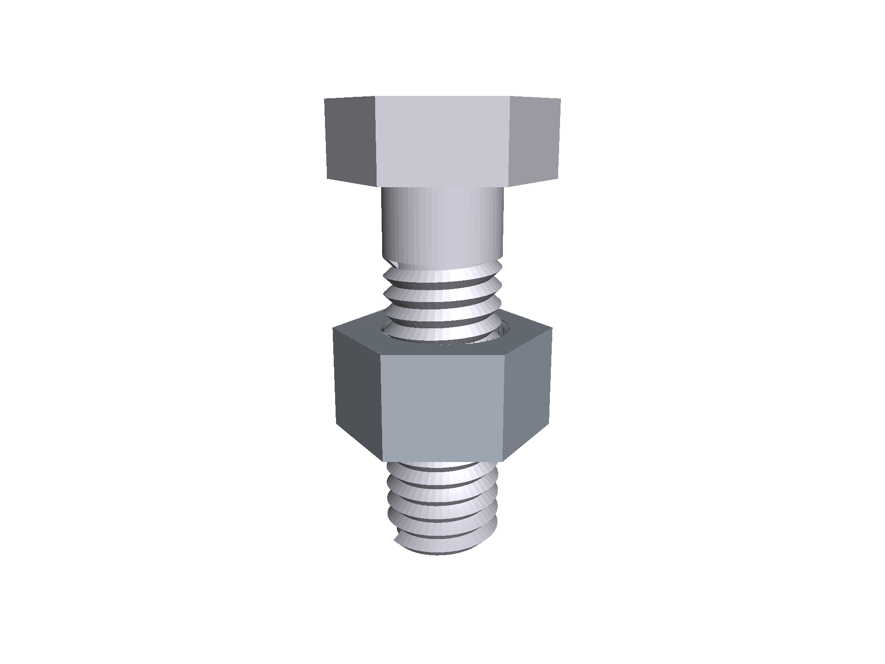
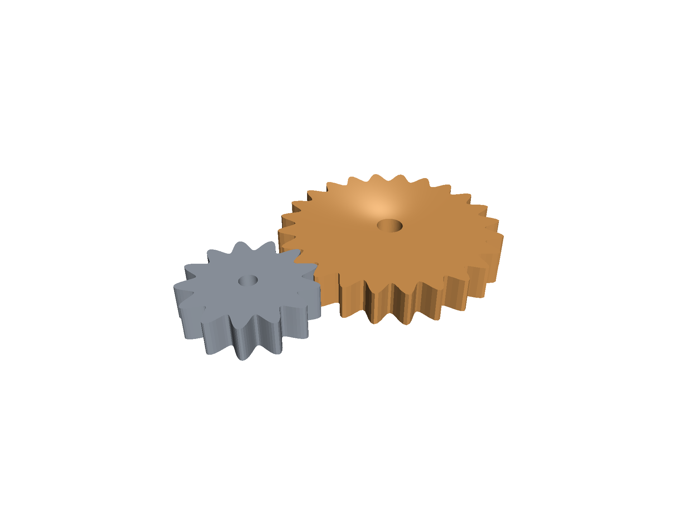
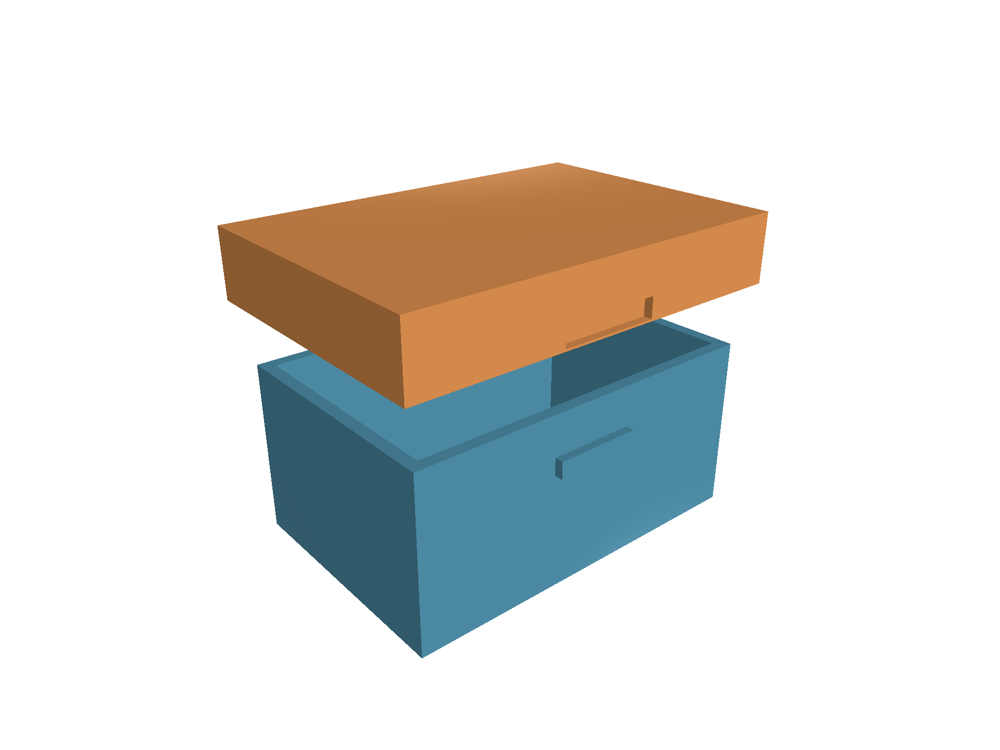
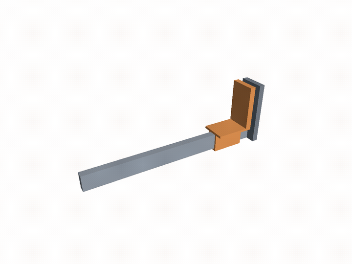
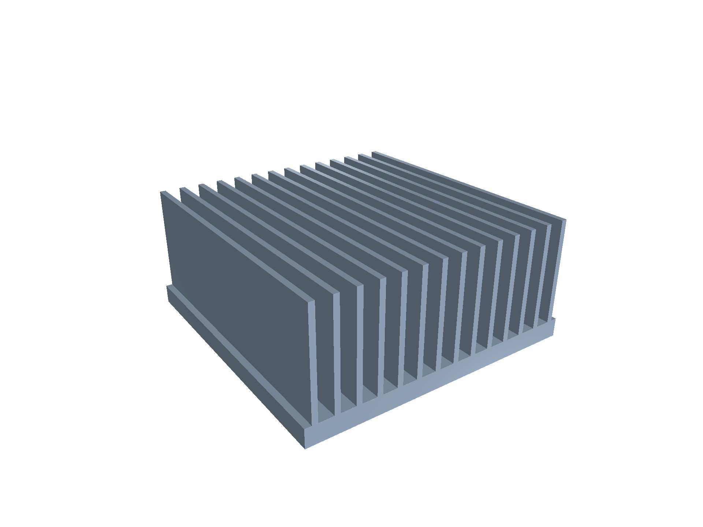
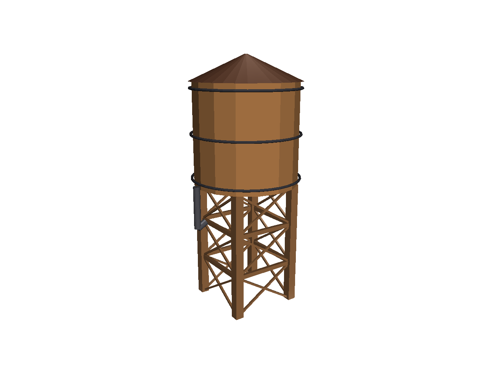
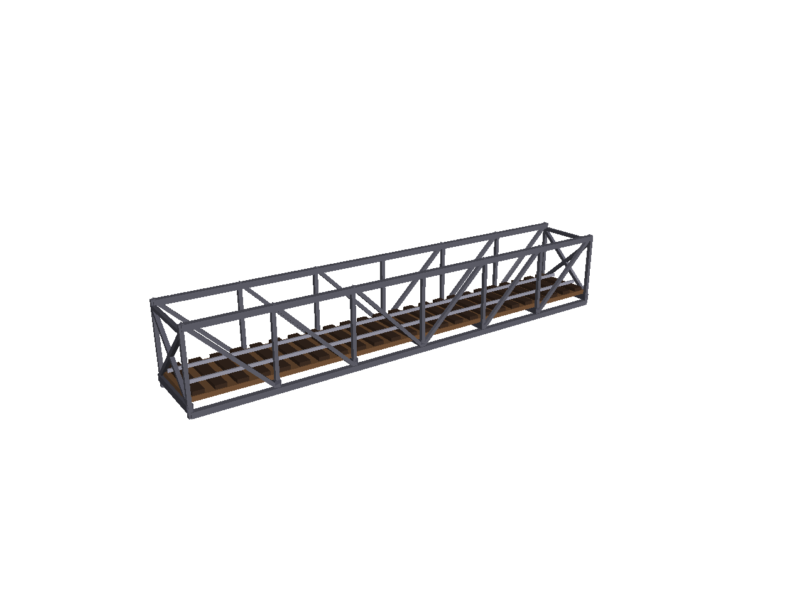

# jscad-mcp-example

Demo projects and walkthroughs for [jscad-mcp](https://github.com/caliperhq/jscad-mcp) — an MCP server that gives Claude visual and structural awareness of OpenJSCAD models.

Each demo is chosen because **it would be painful to design without the visual feedback loop**, and each leans on a different jscad-mcp feature (`take_standard_views`, `slice`, `list_parts` + `highlight` + `label_parts`).

## Gallery

| Cycloidal drive | Engine cutaway |
|---|---|
| [](EXAMPLES.md#cycloidal-drive-reducer) | [](EXAMPLES.md#cutaway-4-stroke-engine) |
| Per-part colored cycloidal reducer with named parts + highlight. The "highlight" feature lets you spotlight any of the four named parts (`eccentric_input`, `cycloid_disc`, `pin_housing`, `output_pins`). | Single-cylinder 4-stroke cutaway with `slice` cross-sections — block, head, piston, conrod, crank, valves, ports, spark plug. |

| Gyroid lattice | Engine — crank-angle sweep |
|---|---|
| [](EXAMPLES.md#gyroid-lattice-cube) |  |
| Marching-cubes-generated triply-periodic minimal surface. The `slice` tool reveals the iconic gyroid cross-section. | 36-frame parameter sweep stepping `crankAngle` 0° → 350° at 12 fps. Piston cycles TDC → BDC → TDC; conrod sweeps its arc. |

| Lofted vase | Voronoi panel |
|---|---|
| [](EXAMPLES.md#lofted-vase) | [](EXAMPLES.md#voronoi-pattern-panel) |
| `extrudeFromSlices` morphing a circular cross-section through four radius control points. | Seeded random sites → half-plane-intersection cells → extrude + subtract holes. |

| Threaded bolt + nut | Spur gear pair |
|---|---|
| [](EXAMPLES.md#threaded-bolt--nut) | [](EXAMPLES.md#spur-gear-pair) |
| `extrudeHelical` triangular thread profile on both bolt and nut, with slice exposing thread engagement. | Cosine-tooth gears at correct center distance, second gear phased so its valley meshes with the first gear's peak. |

| Snap-fit box | Caliper — jaw sweep |
|---|---|
| [](EXAMPLES.md#snap-fit-parametric-box) |  |
| Tolerance-driven snap features: wedges on the box wall, dimples in the lid skirt. Lift the lid to see the catch. | Stylized vernier caliper with `jawExtension` swept 5 → 110 mm over 36 frames at 12 fps. |

| Heatsink fin array | HO water tower |
|---|---|
| [](EXAMPLES.md#heatsink-fin-array) | [](EXAMPLES.md#ho-scale-water-tower) |
| Parametric base + N parallel fins. The slice exposes the inter-fin gap — push fin count too high and watch the gap collapse. | Trackside wooden tank on a braced timber frame, 1:87 scale. Low-segment cylinder = staves for free. |

| HO Pratt truss bridge |
|---|
| [](EXAMPLES.md#ho-scale-pratt-truss-bridge) |
| Through-truss railroad bridge with the Pratt diagonal rule (`\\\` on the left half, `///` on the right). Panels, span, and height all parameterize. |

Full walkthroughs, iteration GIFs, parameter docs, and openjscad.xyz "Try in browser" links: **[EXAMPLES.md](EXAMPLES.md)**.

## Quick start

```bash
git clone https://github.com/caliperhq/jscad-mcp-example.git
cd jscad-mcp-example
```

You can sanity-check the demos without any 3D rendering by requiring them:

```bash
node -e "require('./examples/cycloidal_drive.jscad').main()"
node -e "require('./demos/engine/assembly.js').main()"
node -e "require('./examples/gyroid.jscad').main()"
```

(For the above to find `@jscad/modeling`, either install it via `npm install @jscad/modeling` in this repo, or set `NODE_PATH` to a directory that has it.)

To **render** the demos visually you need [jscad-mcp](https://github.com/caliperhq/jscad-mcp) installed and connected to Claude. Or open any demo in your browser via the openjscad.xyz links in [EXAMPLES.md](EXAMPLES.md).

## Structure

```
examples/                    single-file demos (one .jscad each, math in lib/)
  cycloidal_drive.jscad      named parts + highlight
  gyroid.jscad               marching-cubes TPMS
  vase.jscad                 extrudeFromSlices lofting
  voronoi_panel.jscad        2D pattern → extrude
  thread.jscad               extrudeHelical bolt + nut
  gear_pair.jscad            meshing cosine-tooth gears
  snap_box.jscad             tolerance-driven snap fit
  caliper.jscad              animated mechanism
  heatsink.jscad             parametric fin array
  water_tower.jscad          HO-scale wooden water tower
  truss_bridge.jscad         HO-scale Pratt through-truss railroad bridge
  *_bundled.jscad            generated single-file bundles for openjscad.xyz
  lib/                       shared math (cycloid, gyroid, marching cubes, vase profile,
                               voronoi, thread, gear, loft helpers)
  screenshots/<demo>/        per-demo screenshots + GIFs
demos/engine/                multi-file demo (cutaway 4-stroke engine)
  assembly.js                entry point + per-part PART_COLORS
  block.js, head.js, ...     per-part modules
  engine_bundled.jscad       generated single-file bundle
  screenshots/               iso, oblique, section_axial, top, labeled,
                               crank_sweep.gif (36 frames), iteration.gif
scripts/
  bundle-engine.js           regenerates engine_bundled.jscad
  bundle-examples.js         regenerates the examples/*_bundled.jscad files
  scrub-check.sh             pre-push scrub verification (allowlist-based)
tests/                       unit tests for the math helpers
```

## Built with jscad-mcp

This repo was built in a single Claude Code session using the same jscad-mcp MCP server it demonstrates. The brainstorming phase [estimated about 9 hours of work](EXAMPLES.md#postscript-estimates-vs-reality) at human-developer pace; the actual perception loop — Claude writes geometry, Claude renders it, Claude sees what came out and adjusts — turns out to be a major accelerator. See the postscript in EXAMPLES.md for the full estimates-vs-reality story.

## License

MIT — see [LICENSE](LICENSE).
